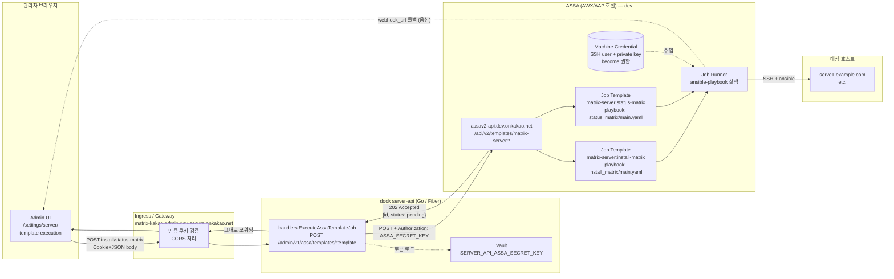
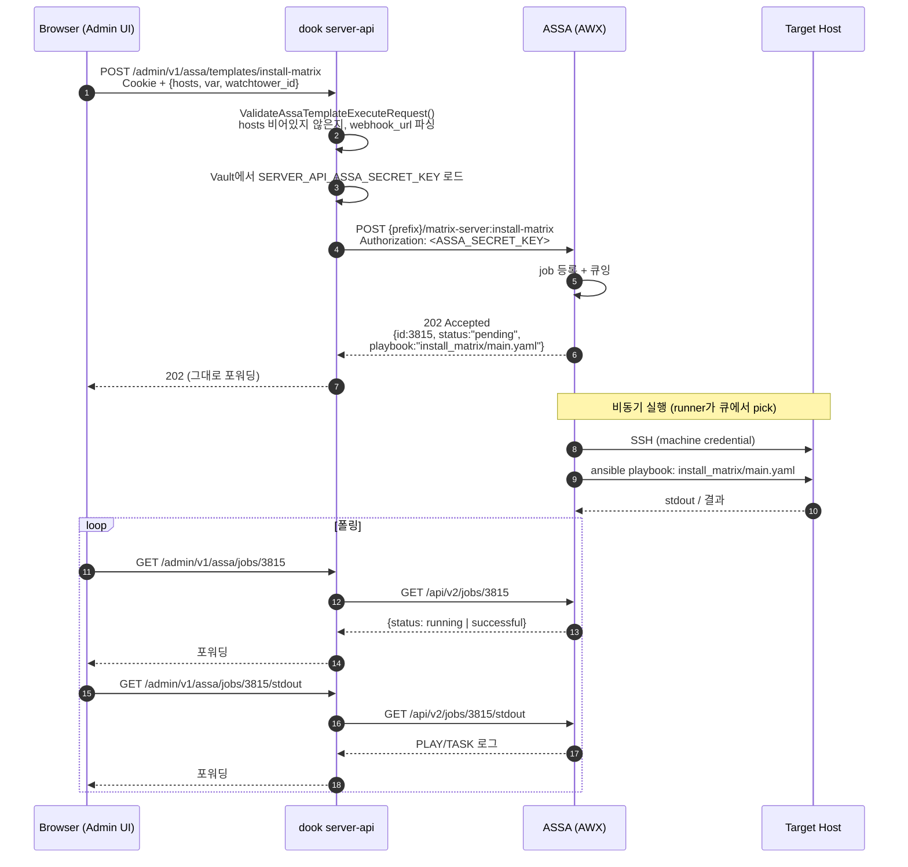
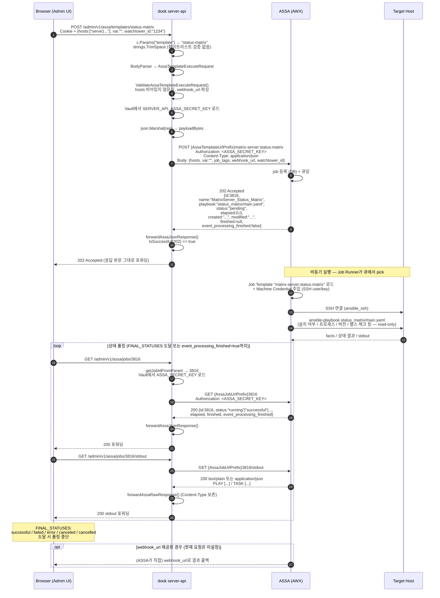
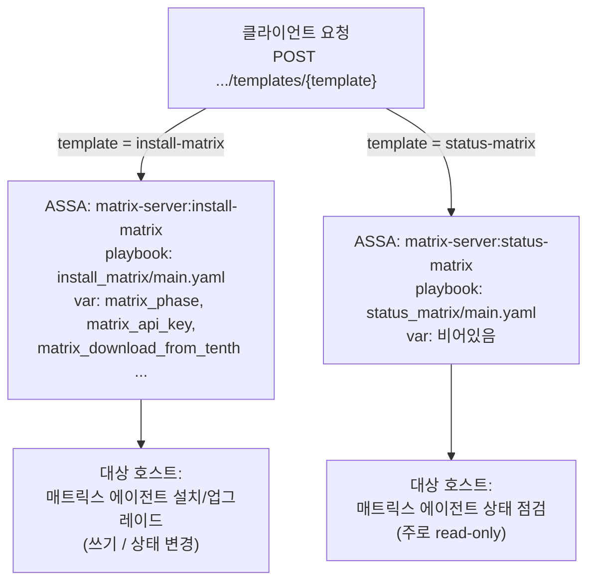

# /admin/v1/assa/templates/{install-matrix|status-matrix} 분석

## 1. 엔드포인트 개요

문서상의 두 엔드포인트는 사실 **단일 라우트의 path-parameter 분기**입니다.

- 라우트 정의 (`projects/dook/server-api/dook-server-api.go:200`)
  ```go
  r.Post("/assa/templates/:template", handlers.ExecuteAssaTemplateJob(conf))
  r.Get ("/assa/jobs/:jobId",         handlers.GetAssaJobStatus(conf))
  r.Get ("/assa/jobs/:jobId/stdout",  handlers.GetAssaJobStdout(conf))
  ```
- `:template`에는 `install-matrix` 또는 `status-matrix`가 들어오도록 설계 (OpenAPI 스펙 `server-api-admin.yaml:502`, 프런트 옵션 `ServerTemplateExecutionInfoPage.jsx:41-44`).
- 핸들러: `projects/dook/server-api/handlers/assa_template_job_handler.go:21` (`ExecuteAssaTemplateJob`)

## 2. 동작 흐름 (install/status-matrix 공통)

1. `c.Params("template")`를 trim해서 그대로 사용 (라인 23).
2. 요청 바디를 `AssaTemplateExecuteRequest`로 파싱 (`requests/assa_template_execute_request.go:9-15`):
   - `hosts []string` (필수)
   - `var string` (Ansible extra-vars 문자열, e.g. `matrix_phase=prod matrix_api_key=...`)
   - `job_tags`, `webhook_url`, `watchtower_id`
3. `ValidateAssaTemplateExecuteRequest`: `hosts` 비어있는지, `webhook_url`이 URL 파싱 가능한지만 검사.
4. Vault에서 `SERVER_API_ASSA_SECRET_KEY` 로드해서 `Authorization` 헤더로 사용.
5. 외부 ASSA v2 API에 프록시 POST 호출
   - URL = `conf.AssaTemplateUrlPrefix + template`
   - prefix 기본값 (`configuration.go:114-117`):
     `https://assav2-api.dev.onkakao.net/api/v2/templates/matrix-server:`
   - 최종 호출 URL: `…/templates/matrix-server:install-matrix` 또는 `…matrix-server:status-matrix`.
6. ASSA 응답을 `forwardAssaJsonResponse`로 그대로 클라이언트에 포워딩.

### install-matrix vs status-matrix 의미
프런트 `ServerTemplateExecutionInfoPage.jsx`에서 만들어지는 `var` 문자열 차이로만 구분되며, 백엔드 코드 자체는 둘을 구분하지 않습니다.
- **install-matrix**: `matrix_phase`, `matrix_api_key`, `matrix_download_from_tenth` 변수가 포함되어 매트릭스 에이전트 설치 playbook 실행.
- **status-matrix**: 추가 변수 없이 설치 상태/헬스 확인 playbook 실행.

## 3. SSH 자격증명

- dook 코드에는 SSH user/password/private key가 전혀 등장하지 않음.
- dook → ASSA 인증은 `SERVER_API_ASSA_SECRET_KEY` (API 토큰)뿐.
- 대상 호스트 SSH 자격은 **ASSA(AWX) 측의 Job Template에 바인딩된 machine credential**에서 공급됨.

```
[Admin UI] ──POST──▶ [dook /admin/v1/assa/templates/:template]
                       │  Authorization: <ASSA_SECRET_KEY>   ← dook→ASSA 인증 (API 토큰)
                       ▼
                   [ASSA(AWX)]  ─── ssh ───▶ [target hosts]
                       ▲                    ↑
                       └── Machine Credential (user + private key/password)
                           = ASSA 내부 credential store
```

## 4. 아키텍처 다이어그램 (Mermaid)

### 컴포넌트 토폴로지



### install-matrix 시퀀스



### status-matrix 시퀀스 (전체)



**install-matrix와의 차이는 다음 두 가지뿐**:
- `var`: install은 `matrix_phase`, `matrix_api_key`, `matrix_download_from_tenth` 포함 / status는 빈 문자열
- ASSA가 매핑하는 Job Template과 playbook: `matrix-server:status-matrix` → `status_matrix/main.yaml` (호스트 상태 점검, 일반적으로 read-only)

dook 측 코드 경로는 install/status가 완전히 동일하며, 검증·인증·timeout 부재 등 보안 이슈도 동일하게 적용됨.

### 두 엔드포인트 차이 요약



## 5. 잠재 취약점 / 위험 포인트

| #  | 위치 | 내용 |
|----|------|------|
| V1 | `assa_template_job_handler.go:55` | **Template Path Injection**: `template` 파라미터에 화이트리스트가 전혀 없음. `strings.TrimSpace`만 함. `install-matrix`/`status-matrix` 외 임의 문자열을 URL에 그대로 이어붙임. Fiber가 `:template`을 단일 세그먼트로만 받기 때문에 `/`는 못 들어가지만 `?`, `#`, `;`, URL-encoded 문자는 통과 가능 → `?foo=bar`로 query injection 또는 `;param`으로 ASSA API의 다른 동작 유발 가능. ASSA가 신뢰하는 인증 토큰으로 호출되므로 **임의 ASSA 템플릿 호출 가능성**. 권장: `template`을 `{"install-matrix","status-matrix"}` 화이트리스트로 검증. |
| V2 | `assa_template_execute_request.go:17` | **Hosts/Var 검증 부재**: `hosts` 항목에 대해 FQDN/소유권/허용 호스트 검증이 없음. 권한 없는 호스트에 ansible로 매트릭스 에이전트가 설치/조회되어 **임의 호스트 코드 실행 (ansible playbook)** 효과 발생 가능. |
| V3 | 동상 | **Ansible Extra-Vars Injection (`var`)**: `var` 문자열이 검증 없이 ASSA에 전달되어 playbook의 extra-vars로 평가될 가능성. 사용자가 `matrix_*` 외의 키나 quoting을 통해 변수 덮어쓰기/명령 흐름 조작 가능. 키 화이트리스트로 제한 필요. |
| V4 | `var` 빌더 (`ServerTemplateExecutionInfoPage.jsx:54-63`) | `apiKey` 값을 따옴표 처리 없이 공백으로 join → 키에 공백/`=`/따옴표가 포함되면 var 파싱이 깨지거나 다른 변수 주입 가능. (프런트 단이지만 백엔드에서도 차단 안 됨) |
| V5 | `assa_template_execute_request.go:28-32` | **Webhook SSRF**: `webhook_url`을 `url.ParseRequestURI`만 함. 스킴/호스트 필터링 없음. 내부망(`169.254.169.254`, `localhost`, 내부 VPC) URL이 ASSA를 경유해 콜백 → ASSA 측에서 내부 자원으로 SSRF 가능. 화이트리스트 도메인/스킴 (`https://` 한정) 권장. |
| V6 | `assa_template_job_handler.go:53-62` | **Timeout 없음**: `context.Background()` 사용 → ASSA 응답 지연 시 무한 대기, request 고갈. `context.WithTimeout` 권장. |
| V7 | `assa_template_job_handler.go:144-169` | **에러 본문 그대로 포워딩**: ASSA에서 내려온 에러 응답 본문(내부 스택/메시지 가능)을 클라이언트로 그대로 전달 → 정보 누출 우려. 정제된 메시지로 매핑 권장. |
| V8 | `dook-server-api.go:188-203` | **인가 정책 확인 필요**: `admin/v1` 그룹에 인증/RBAC 미들웨어가 해당 발췌에선 안 보임. 상위 레이어에서 적용된다 하더라도 코드 레벨에서 admin 권한 체크가 명시되어 있는지 검증 필요. 이 엔드포인트는 ASSA 토큰을 그대로 사용해 임의 호스트에 ansible playbook을 트리거하므로 인가 우회 시 영향이 매우 큼. |
| V9 | `assa_template_job_handler.go:39, 81, 116` | **Authorization 헤더에 raw 시크릿**: `SERVER_API_ASSA_SECRET_KEY` 값을 그대로 `Authorization` 헤더에 사용. ASSA 명세상 토큰 스킴(`Bearer`, `Token`) 누락 여부 확인. |
| V10 | `configuration.go:114-117` | **dev 엔드포인트가 default**: ASSA URL prefix가 `dev.onkakao.net`. 운영 배포 시 환경변수로 override되어야 정상. override 누락 시 운영 트래픽이 dev ASSA로 전달되는 위험. |

## 6. 우선 권고 조치

1. **`template` 화이트리스트 검증 추가** (V1) — 가장 직접적이고 위험.
2. **`hosts` 허용 도메인/소유권 검증** (V2) — 임의 호스트 RCE 위험 차단.
3. **`var` 키 화이트리스트화** (V3) — install/status별 허용 변수만 통과.
4. **`webhook_url` 스킴·내부망 차단** (V5).
5. **외부 호출에 timeout 부여** (V6), **admin 라우트 인증/인가 코드 명시** (V8).
